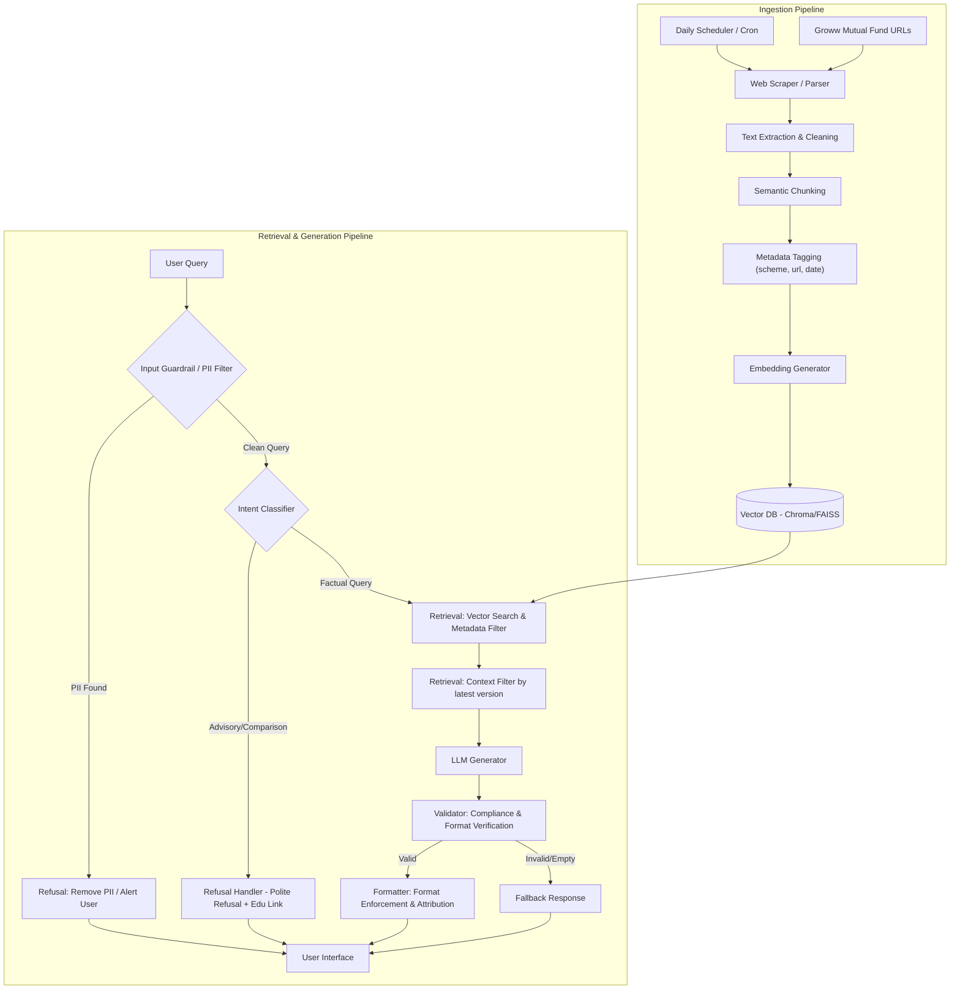

# System Architecture: Mutual Fund FAQ Assistant (RAG System)

This document details the system architecture and data flow for the **Mutual Fund FAQ Assistant**, a Retrieval-Augmented Generation (RAG) system built with the context of the **Groww** product ecosystem.

---

## 🏗️ System Overview

The system is structured in three core segments:
1. **Phase 0: Project Scaffolding & Configuration:** Sets up the repository structure, environment variables, dependency management, and target corpus/source registries.
2. **Ingestion & Indexing Pipeline (Offline/Batch):** Daily scheduled task that scrapes, cleans, chunks, embeds, and indexes the mutual fund scheme data from approved sources to keep data (such as NAV) up to date.
3. **Query, Retrieval, & Response Pipeline (Online/Real-time):** Directly handles customer inputs. It operates along an explicit flow:
   Query → Retrieval → LLM → Validator → Formatter → Response




---

## 📦 Key Component Breakdown

### 0. Project Scaffolding & Configuration
- **Repository Structure Setup:** Establishes a modular directory structure (e.g., config, ingestion, retrieval, validation, formatter, interface).
- **Dependency Management:** Configures dependencies via `requirements.txt` or `pyproject.toml`.
- **Environment Configuration:** Manages secrets (e.g., API keys) via `.env` variables and sets up vector storage path configurations.
- **Corpus / Source Registry:** A centralized configuration system mapping mutual fund schemes to target seed URLs and metadata rules.

### 1. Ingestion & Preprocessing Pipeline
- **Daily Scheduler:** A cron job or time-based automation triggers the crawler daily to scrape the latest facts (e.g. daily NAV updates) and update the vector store.
- **Web Crawler / Scraper:** Crawls the 5 target HDFC Groww URLs. It extracts unstructured data (like descriptions, FAQs, investment objectives) and structured details (NAV, expense ratio, exit loads, fund managers).
- **Text Cleaning & Normalization:** Strips HTML boilerplate (header navigation, footers, ad-banners) to keep the token payload minimal and context clean.
- **Chunking Strategy:** 
  - **Recursive Character Chunking:** Splits text by semantic boundaries (paragraphs, sentences) with a target chunk size of `500-800 characters` and an overlap of `100 characters`.
  - **Structured Key-Value Extraction:** Key fund attributes (NAV, Expense Ratio, Managers) are indexed separately as structured metadata key-values to answer precise parametric questions without relying solely on semantic vector matches.
- **Metadata Enrichment:** Each document chunk is tagged with crucial metadata attributes:
  - `scheme_name` (e.g., *HDFC Mid-Cap Opportunities Fund*)
  - `source_url` (direct scheme page URL)
  - `last_updated_date` (timestamp of indexing or crawl date)

### 2. Guardrails & Intent Classification
To enforce the **Facts-Only** policy and meet security/privacy goals, the system runs pre-retrieval guardrails:

- **PII Detector:** Uses Regular Expressions and Named Entity Recognition (NER) to check if the user query contains sensitive personal data (PAN, Aadhaar, phone numbers, emails, bank accounts). If detected, it aborts the request and returns a security warning.
- **Intent Classifier:** Classifies incoming queries into **Factual** vs. **Advisory/Comparative**.
  - **Allowed:** *"What is the exit load of HDFC Small Cap Fund?"* or *"Who manages HDFC Defence Fund?"*
  - **Refused:** *"Should I buy HDFC Mid-Cap Fund?"*, *"Which fund is better: small cap or mid cap?"*, or *"Can you build me a portfolio?"*
  - **Handler:** Advisory/Comparative queries bypass retrieval and directly trigger the **Refusal Handler** which outputs a predefined friendly refusal along with a reference link to AMFI/SEBI.

### 3. Retrieval Pipeline
- **Vector Store (ChromaDB / FAISS):** Stores the dense vector embeddings generated from the chunks (using a model like `text-embedding-3-small` or `all-MiniLM-L6-v2`).
- **Semantic Retrieval:** Performs a cosine similarity search between the query embedding and the chunk embeddings.
- **Metadata Filtering & Sorting:**
  - If a user mentions a specific scheme, retrieval is hard-filtered by `scheme_name` metadata to prevent cross-talk.
  - Chunks are sorted by `last_updated_date` so that context from the **latest documents** is prioritized.

### 4. LLM Generation
- **Context Construction:** The system feeds the retrieved chunks and structured attributes into the LLM.
- **System Prompt Design:** Uses a highly-restrictive system prompt template:
  ```yaml
  system_instructions: |
    You are a Mutual Fund Facts Assistant.
    Provide an answer based ONLY on the provided context. Do NOT make inferences, calculate returns, or assume details not explicitly written.
    Limit the response to a maximum of 3 sentences.
    If the context does not contain the answer, reply with the exact fallback text.
    Do not offer advice, opinions, comparisons, or recommendations.
  ```

### 5. Validator
The Validator runs post-generation compliance checks to verify output integrity before any formatting or sending to the user:
- **Facts-only Compliance Checks:** Verifies that the LLM has not generated speculative remarks, projections, return assumptions, or recommendations.
- **Citation Presence Checks:** Confirms that the retrieved context has matching source metadata to build a valid citation link.
- **Response Length Validation:** Ensures the generated response strictly fits the maximum limit of 3 sentences.
- **Fallback Handling:** Triggers the fallback pipeline if the LLM output indicates missing information, if the retrieval confidence is low, or if the facts-only compliance validation fails.

### 6. Formatter
Once the response passes validation, the Formatter structures the final payload to ensure layout consistency:
- **Append Exactly One Citation:** Formats and appends exactly one verified, deep citation link pointing to the specific document source page used.
- **Add Metadata Footer:** Appends a line stating the last sync date in the exact format: `Last updated from sources: YYYY-MM-DD`.
- **Enforce Consistency:** Standardizes spacing, disclaimers, and font presentation.

### 7. Fallback Mechanism
- If the Validator flags a failure, the system returns a standard, user-friendly refusal:
  > *"I am sorry, but the verified information for your query could not be located in the approved sources. Please refer directly to the [HDFC Mutual Fund Factsheet](https://groww.in/mutual-funds/hdfc-mid-cap-fund-direct-growth) or consult a SEBI-registered advisor."*

---

## 💻 Recommended Technology Stack

- **Frontend UI:** React/Vite single-page application styled with vanilla CSS after the Groww brand guidelines:
  - Header displays the logo area containing the "Groww Buddy" title and a warning subtext ("Facts-only. No investment advice.").
  - Footer contains direct clickable links to official pages: Privacy Policy (`https://groww.in/pages/privacy-policy`) and Terms and conditions (`https://groww.in/pages/terms-and-conditions`).
- **Orchestration Framework:** LangChain or LlamaIndex (for document loading, chunking, and pipeline orchestration).
- **Vector Database:** ChromaDB (lightweight, file-based vector storage ideal for local runs).
- **LLM/Embeddings:** Gemini API (`gemini-1.5-flash` for fast, low-cost generation and embeddings) or OpenAI API.
- **Web Scraping:** Beautiful Soup / Playwright (for reliable client-side rendering retrieval if scraping the dynamic Groww React pages).
